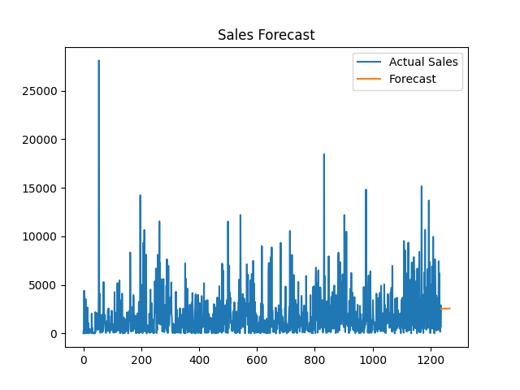

# Machine Learning Task 1 (2026)
# Sales & Demand Forecasting for Businesses

This project was developed as part of the internship task from Future Interns.

# Project Objective
The goal of this project is to predict future sales using historical business data.  
Sales forecasting helps businesses plan inventory, manage staffing, and improve decision-making.

## Dataset
The dataset used is the **Superstore Sales Dataset**, which contains information about:
- Order Date
- Sales
- Product Categories
- Region
- Profit

For this project, we focused on:
- Order Date
- Sales

## Tools & Technologies Used
- Python
- Pandas
- Scikit-learn
- Matplotlib

## Key Steps in the Project
1. Data cleaning and preprocessing
2. Converting order dates into time features
3. Aggregating daily sales data
4. 
5. Building a forecasting model using Linear Regression
6. Visualizing actual vs predicted sales

## Sales Forecast Visualization

## Business Insights
The forecast helps businesses:
- Predict future demand
- Manage inventory effectively
- Plan staffing during high demand periods
- Avoid overstocking or stock shortages

## Conclusion
This project demonstrates how machine learning can support business decision-making by analyzing historical sales data and forecasting future trends.

